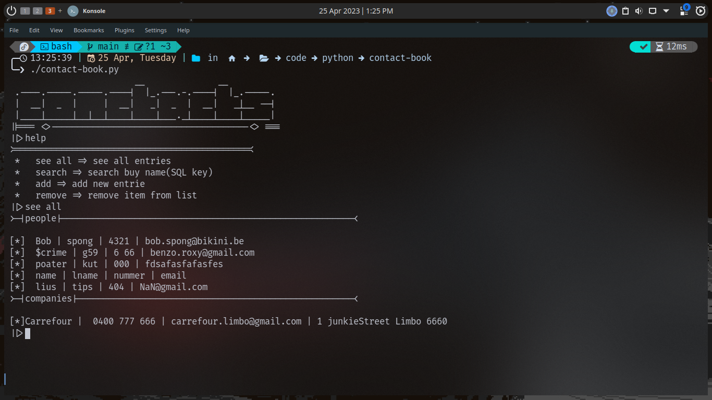

# contact-book.py



This is a py script to manage contacts in a sqlite3 database

## requiremnts

   * python
   * pip 
   * sqlite3

>**_Note!_**: i also recomend using Fira Code font with this script

## how to use

**clone** the repo into a folder
```sh
git clone https://github.com/ASNstoleMYname/contact-book.py.git
```
after downloading the repo run the following commands
```sh
cd contact-book
chmod +x contact-book.py
```
this will make ``contact-book.py`` executable.

To run ``cd ~/`` into contact-book and execute the ```contact.py```.
```sh
./contact-book.py
```
Incase you one add a command for this program you can simply add the following to your **``.bashrc``** or what ever you use.

```sh
alias contact-book="~/[PATH]/contact-book/contact-book.sh"
```
## Usage

Type ``help``, to list all commands.

### ALL COMMANDS
    * see all
    * search
    * add
    * remove
    * close
    * help


